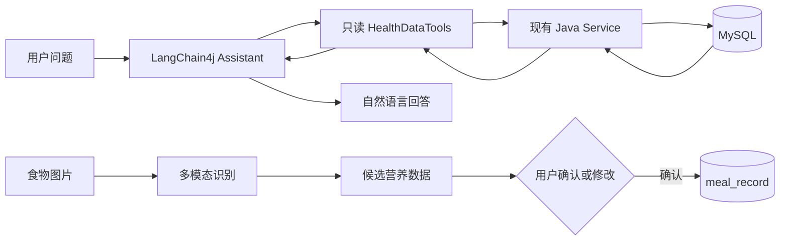

# FitMind

FitMind 是一个面向个人健康记录场景的全栈项目，将结构化健康数据管理、多模态食物识别和基于真实数据的 AI 问答整合在同一套应用中。

## 项目简介

项目以 Java 后端和 MySQL 为业务核心，管理体重、饮食、身体维度与每日健康信。前端负责记录、可视化和结果确认；AI 负责识别食物图片，并通过 LangChain4j Tool Calling 查询已有健康数据。Python 模块只做离线数据质量检查，不替代 Java 业务后端。

当前版本使用固定演示用户 `userId=1`，未实现登录和权限系统。

## 核心功能

- 体重、目标体重与身体维度管理
- 饮食记录的新增、编辑、删除和按日期查询
- 体重趋势、减重进度、营养结构与餐次热量可视化
- 多模态饮食图片识别，输出可编辑的食物与营养候选数据
- AI 候选结果经用户确认后再写入 MySQL
- LangChain4j Tool Calling 自然语言查询体重、饮食和营养数据
- 每日健康信规则生成，并预留大模型生成能力
- Python 离线数据标准化、异常检测、缺失检查和报告生成

## 技术栈

| 模块 | 技术 |
| --- | --- |
| 后端 | Java 8、Spring Boot 2.7.18、MyBatis-Plus 3.5.5、MySQL、Bean Validation、JUnit 5、Mockito |
| 前端 | Vue 3、Vite、Vue Router、Element Plus、ECharts、Three.js、pnpm |
| AI / Data | LangChain4j 0.31.0、OpenAI-compatible 大模型 API、Tool Calling、多模态模型、Python、pandas、NumPy |

## AI 功能设计



- AI 健康助手只开放查询类 Tool，不允许模型新增、修改或删除数据库记录。
- Tool 调用现有 Service，模型不能执行任意 SQL。
- 日期范围、体重变化、平均值和营养汇总由 Java 计算，模型只负责选择 Tool 和组织回答。
- Tool 结果包含查询范围、记录数量和缺失数据状态，数据不足时明确返回，不让模型补造数字。
- 食物图片先生成候选结果；只有用户确认后，前端才调用饮食保存接口。
- 每次 Tool 调用记录名称、参数、耗时、成功状态和异常类型，便于排错与测试。

## 项目结构

```text
FitMind/
├─ backend/       Spring Boot API、业务服务、Tool Calling 与测试
├─ frontend/      Vue 3 页面、ECharts 图表和 Three.js 身体画像
├─ python-data/   只读数据质量检查与清洗预览
├─ deployment/    Nginx 与 systemd 部署示例
├─ 一键启动.bat
└─ 一键关闭.bat
```

## 本地运行方式

### 1. 环境要求

- JDK 8
- Maven 3.6+
- MySQL 8
- Node.js 20.19+ 与 pnpm
- Python 3.7+（仅运行离线数据模块时需要）

### 2. 准备 MySQL

公开仓库不提供数据库 SQL 文件。请在本地或部署环境中自行准备 `fitmind` 数据库及项目所需表结构，并通过私有迁移流程维护；不要把数据库结构、导出数据或初始化脚本提交到公开仓库。

### 3. 配置数据库和 AI

复制示例文件：

```cmd
copy backend\ai-local.properties.example backend\ai-local.properties
```

在本地 `backend/ai-local.properties` 中填写数据库密码、模型 API Key、兼容接口地址和模型名。该文件已被 Git 忽略，不能提交真实 Key。也可以使用 `FITMIND_DB_PASSWORD`、`DASHSCOPE_API_KEY` 等环境变量；完整字段见示例文件。

### 4. 启动后端

```cmd
cd backend
mvn.cmd clean test
mvn.cmd spring-boot:run
```

后端默认地址：`http://127.0.0.1:8080`。

### 5. 启动前端

```cmd
cd frontend
pnpm.cmd install
pnpm.cmd run dev
```

前端默认地址：`http://127.0.0.1:5299`，开发环境通过 Vite 将 `/api` 代理到后端。

### 6. 运行 Python 数据检查

```cmd
cd python-data
python -m pip install -r requirements.txt
set FITMIND_DB_PASSWORD=YOUR_MYSQL_PASSWORD
python main.py --check
python -m unittest discover -s tests -v
```

Python 默认只读 MySQL，并把报告写入已忽略的 `python-data/reports/`，不会自动修改正式数据。

## 项目截图

> 截图区域已预留。公开版将使用脱敏演示数据重新截图；本地验收截图因包含个人健康记录，不纳入仓库。

## 安全说明

- 仓库不包含可用的 API Key、数据库密码、Token 或本地私密配置。
- `ai-local.properties`、`.env`、日志、构建产物、数据质量报告和数据库导出均被忽略。
- 示例配置只提供占位符；公开部署时应通过服务器环境变量或受控配置文件注入密钥。
- 健康和营养输出仅用于项目演示与日常记录，不构成医学诊断或治疗建议。
